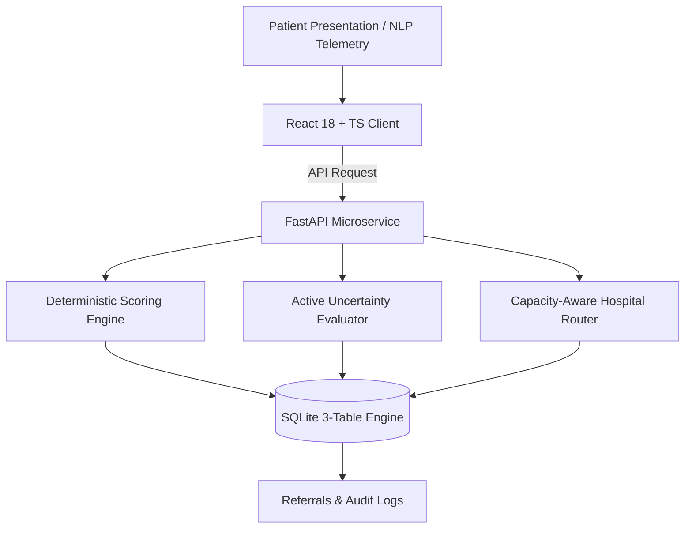

# SetuHealth — Early Health-Risk Detection & Capacity-Aware Decision Support

> **Team NeuralX (T26)** · Round 2 Solution  
> *Preventing clinical triage delays and emergency department overburdens through deterministic risk evaluation, active uncertainty detection, and location-aware hospital capacity routing.*

---

## 🏥 Problem Statement
In distributed public health systems, up to **60% of emergency department presentations** at tertiary medical colleges are non-critical cases that could be treated at Community Health Centres (CHCs), while critical emergency referrals face delays or lost-to-follow-up due to "blind referrals" (dispatching ambulances without prior bed confirmation).

**SetuHealth** bridges this divide with:
1. **Deterministic Physiological Scoring**: Mathematical NEWS2-inspired scoring matrices that prevent AI hallucinations in acute triage grading.
2. **Active Clinical Uncertainty Handling**: Explicitly flagging ambiguous symptom presentations (e.g. post-prandial epigastric vs. STEMI) and prompting human clinical validation rather than guessing.
3. **Live Geolocation & Bed-Capacity Routing**: Real-time GPS and OpenStreetMap reverse-geocoding to match patient acuity with nearby facilities having confirmed ICU, Oxygen, and General bed availability within a realistic radius (0.6 km – 5.1 km).
4. **Closed-Loop Accountability Engine**: Production SQLite 3-table persistence tracking referrals from intake to arrival confirmation, flagging outcome mismatches and recording verifiable telemetry.

---

## 🛠️ Architecture & Tech Stack



* **Frontend**: React 18, TypeScript, Vite, TailwindCSS, Lucide Icons
  * *Design Philosophy*: Warm Alabaster Glass & Brushed Champagne Metallurgy
* **Backend**: FastAPI (Python 3.12), Pydantic v2, Uvicorn
* **Database**: SQLite 3 relational schema (`referrals`, `facilities`, `audit_logs`)
* **GIS & Geocoding**: Browser Geolocation API + OpenStreetMap Nominatim Reverse Geocoder
* **Compliance**: FHIR R4 aligned data structures, NEWS2 physiological brackets

---

## 🚀 Quick Start Guide

### 1. Backend Service (FastAPI)
```bash
# Navigate to the backend directory
cd setuhealth/setuhealth

# Install Python dependencies
pip install -r requirements.txt

# Run the FastAPI server
uvicorn main:app --reload --port 8000
```
*API Swagger Docs available at:* `http://127.0.0.1:8000/docs`

### 2. Frontend Application (Vite + React)
```bash
# In the root directory:
npm install

# Run the local development server
npm run dev
```
*Web App available at:* `http://localhost:5173/`

---

## 🧪 Preset Clinical Scenarios
* **1. Acute Chest Pain (Critical)**: Vitals automatically calibrate to **All 4 Red** (Heart Rate 118 bpm, BP 162/98, SpO₂ 91%, Temp 101.4°F) $\rightarrow$ Direct routing to cath-lab capable tertiary trauma centers.
* **2. Ambiguous Symptoms (Uncertainty)**: Calibrates to **1 Red and 3 Greens** ($BP$ elevated, others normal) $\rightarrow$ Triggers the Active Uncertainty modal requiring clinical clarification questions.
* **3. Moderate Wheeze (Medium)**: Calibrates vitals for secondary care matching $\rightarrow$ Routes to Community Health Centres with oxygen beds, preserving tertiary ICU capacity.

---

## 👥 Authors
* **Team NeuralX (T26)**
